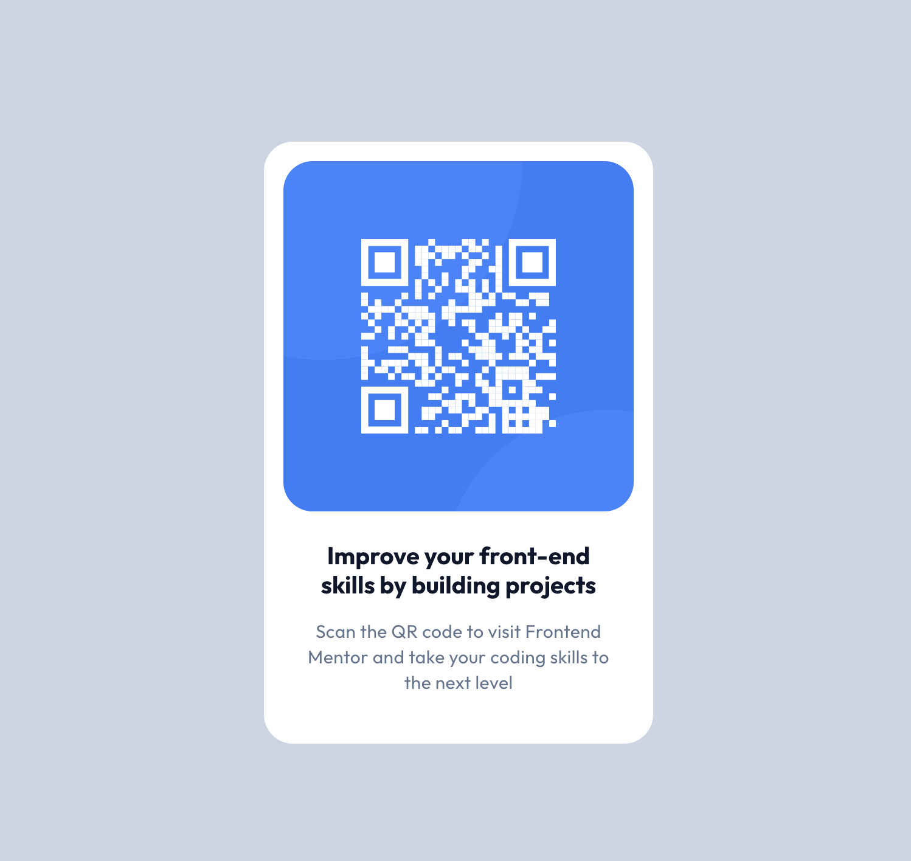

# Frontend Mentor - QR code component solution

This is a solution to the [QR code component challenge on Frontend Mentor](https://www.frontendmentor.io/challenges/qr-code-component-iux_sIO_H). Frontend Mentor challenges help you improve your coding skills by building realistic projects. 

## Table of contents

- [Overview](#overview)
  - [Screenshot](#screenshot)
- [My process](#my-process)
  - [Built with](#built-with)
  - [What I learned](#what-i-learned)
  - [Useful resources](#useful-resources)

**Note: Delete this note and update the table of contents based on what sections you keep.**

## Overview

### Screenshot

### Links

- Live Site URL: [Add live site URL here](https://frontend-challenge-qr-code-ten.vercel.app/)

## My process

### Built with

- Semantic HTML5 markup
- Flexbox
- CSS Grid
- Mobile-first workflow
- [React](https://reactjs.org/) - JS library
- [Next.js](https://nextjs.org/) - React framework
- [Tailwind](https://tailwindcss.com/) - For styles

**Note: These are just examples. Delete this note and replace the list above with your own choices**

### What I learned

Writing JS code is easy when you always use `
`, right?  
That’s what I’ve been doing—moving away from semantic HTML elements because there are just too many to remember, and it hasn’t felt practical in my hands-on projects so far. But in this project, I tried to make an effort to dive in and actually learn and use them.

### <mark>Today's semantic HTML elements:</mark>
`section` 👉🏻 groups related content on a page. 
`article` 👉🏻 is a self-contained piece of content. 
`figure` 👉🏻 is just for media with an optional caption.

   ###### References code inside the repository:  
 [`<article/>` element is the QR Code card](https://github.com/SarahSalem-hub/frontend-challenge-qr-code/blob/b6f7e55800adea24df028d223e49f1ddf316eb45/app/components/QrCard.tsx#L9)

[`<figure/>` element wraped the Image](https://github.com/SarahSalem-hub/frontend-challenge-qr-code/blob/main/app/components/QrCard.tsx#L10)

### Useful resources

- [Raycast](https://www.raycast.com/) - This really helped me quickly remember Tailwind classes using the Tailwind extension. It was super helpful.

